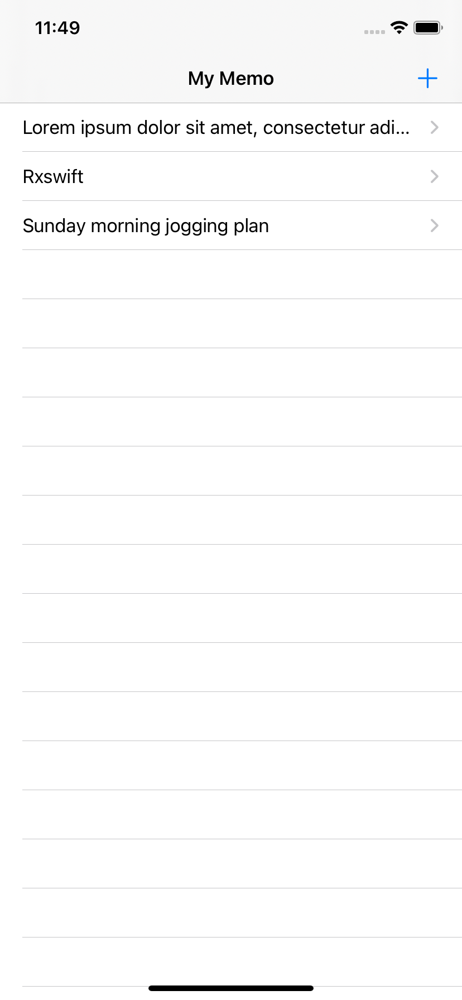
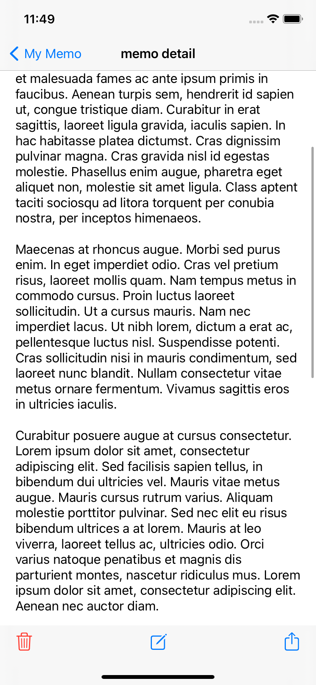
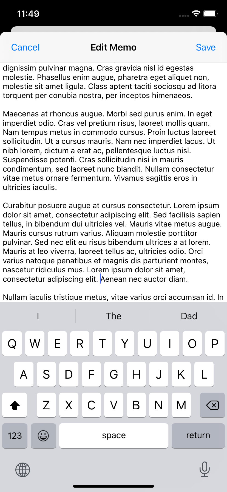

## SimpleMemo

A simple iOS memo app using rxswift.

  

## Features

- Adding, deleting, updating, retrieving memo
- Memo saved permanently

## Installation

```bash
git clone https://github/com/korJAEYOUNGYUN/SimpleMemo.git
pod install
```
